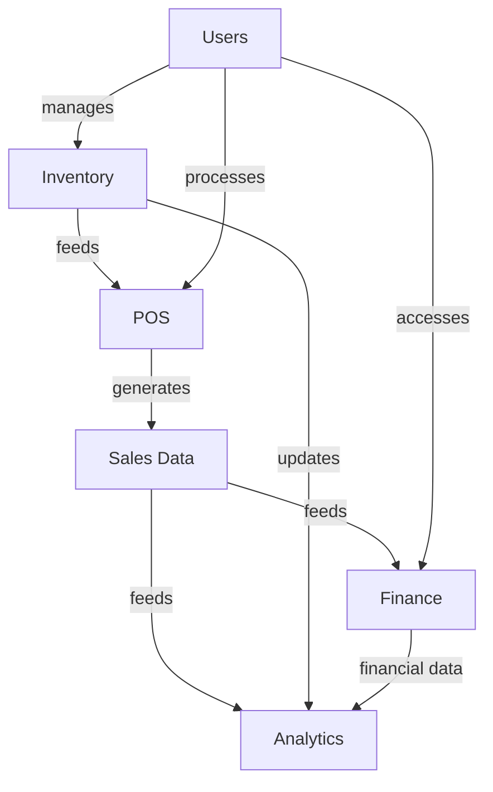

# TechCity ERP - Module Breakdown

## 1. Inventory Module (`/apps/inventory/`)

### Core Components
- **Product Management**
  - Product catalog with variants
  - Barcode/QR code support
  - Category management
  - Batch/Serial number tracking

- **Stock Management**
  - Multi-location inventory
  - Stock level monitoring
  - Stock movement tracking
  - Reorder point alerts

- **Purchase Management**
  - Purchase order creation
  - Supplier management
  - Goods receipt processing
  - Purchase returns

- **Stock Transfers**
  - Inter-branch transfers
  - Transfer requests
  - Stock receipt confirmation
  - Transfer history

### Key Models
- `Inventory`: Main inventory items
- `Product`: Product master data
- `Supplier`: Vendor information
- `PurchaseOrder`: Purchase orders
- `Transfer`: Stock transfers between branches
- `StockTake`: Inventory counting

---

## 2. Point of Sale - POS (`/apps/pos/`)

### Core Components
- **Sales Processing**
  - Quick product search
  - Barcode scanning
  - Cart management
  - Discounts and promotions

- **Customer Management**
  - Customer profiles
  - Purchase history
  - Loyalty programs
  - Customer credit

- **Payment Processing**
  - Multiple payment methods
  - Split payments
  - Receipt generation
  - Returns and refunds

### Key Models
- `Sale`: Sales transactions
- `SaleItem`: Line items in sales
- `Customer`: Customer information
- `Payment`: Payment records
- `Receipt`: Sales receipts

---

## 3. Finance Module (`/apps/finance/`)

### Core Components
- **Accounting**
  - Chart of accounts
  - General ledger
  - Journal entries
  - Trial balance

- **Invoicing**
  - Invoice generation
  - Recurring invoices
  - Payment tracking
  - Credit notes

- **Financial Reporting**
  - Profit & Loss statements
  - Balance sheets
  - Cash flow statements
  - Tax reports

### Key Models
- `Invoice`: Customer invoices
- `Payment`: Payment records
- `Account`: Chart of accounts
- `JournalEntry`: Accounting entries
- `Expense`: Business expenses

---

## 4. Company & Settings (`/apps/company/`, `/apps/settings/`)

### Core Components
- **Company Profile**
  - Company information
  - Branch management
  - Tax information
  - Business hours

- **System Settings**
  - User permissions
  - System preferences
  - Notification settings
  - Integration settings

### Key Models
- `Company`: Company information
- `Branch`: Business locations
- `UserProfile`: Extended user information
- `SystemSetting`: Application settings

---

## 5. User Management (`/apps/users/`)

### Core Components
- **Authentication**
  - User registration
  - Login/logout
  - Password management
  - Two-factor authentication

- **Authorization**
  - Role-based access control
  - Permission management
  - User groups

### Key Models
- `User`: System users
- `Role`: User roles
- `Permission`: Access permissions
- `UserActivity`: User actions log

---

## 6. Employee Management (`/apps/employee_management/`)

### Core Components
- **Employee Records**
  - Personal information
  - Employment details
  - Documents
  - Leave management

- **Attendance**
  - Time tracking
  - Leave requests
  - Attendance reports

### Key Models
- `Employee`: Staff information
- `Department`: Organizational units
- `Attendance`: Time tracking
- `LeaveRequest`: Leave applications

---

## 7. Booking System (`/apps/booking/`)

### Core Components
- **Appointment Scheduling**
  - Calendar view
  - Resource allocation
  - Booking management
  - Reminders

### Key Models
- `Appointment`: Booking details
- `Resource`: Bookable resources
- `TimeSlot`: Available time slots

---

## 8. Analytics & Reporting (`/apps/Analytics/`)

### Core Components
- **Sales Analytics**
  - Revenue reports
  - Sales trends
  - Product performance
  - Customer insights

- **Inventory Analytics**
  - Stock movement
  - Reorder analysis
  - Inventory valuation

### Key Models
- `Report`: Saved reports
- `Dashboard`: Custom dashboards
- `KPI`: Key performance indicators

---

## 9. Notification System (`/apps/notification_app/`)

### Core Components
- **Real-time Alerts**
  - Stock alerts
  - Payment reminders
  - System notifications

- **Messaging**
  - Internal messaging
  - Email notifications
  - SMS alerts

### Key Models
- `Notification`: System notifications
- `Message`: Internal messages
- `Alert`: Custom alerts

---

## 10. Vouchers & Promotions (`/apps/vouchers/`)

### Core Components
- **Voucher Management**
  - Voucher creation
  - Discount rules
  - Validity periods
  - Usage tracking

### Key Models
- `Voucher`: Discount vouchers
- `Promotion`: Marketing promotions
- `DiscountRule`: Pricing rules

---

## Integration Points

1. **Inventory → POS**
   - Real-time stock updates
   - Price synchronization
   - Product availability

2. **POS → Finance**
   - Sales recording
   - Payment processing
   - Tax calculations

3. **All Modules → Analytics**
   - Data aggregation
   - Performance metrics
   - Business intelligence

## Dependencies

## Module Interdependencies

1. **Core Dependencies**
   - All modules depend on Users for authentication
   - POS requires Inventory for product data
   - Finance depends on POS for sales data

2. **Data Flow**
   - Inventory changes trigger stock updates
   - Sales generate financial transactions
   - All modules feed into Analytics

## Implementation Notes

1. **Shared Components**
   - Authentication service
   - Notification system
   - Reporting engine
   - Data export/import

2. **Common Services**
   - File storage
   - Email/SMS services
   - PDF generation
   - Barcode/QR code generation

3. **Third-party Integrations**
   - Payment gateways
   - Tax calculation services
   - Shipping providers
   - E-commerce platforms

## Security Considerations

1. **Access Control**
   - Role-based permissions
   - Data segregation by branch/company
   - Audit logging

2. **Data Protection**
   - Encryption at rest and in transit
   - Regular backups
   - GDPR compliance

3. **Audit Trails**
   - User activity logging
   - Data modification history
   - Access logs

## Performance Optimization

1. **Caching Strategy**
   - Frequently accessed data
   - Report results
   - Static content

2. **Database Optimization**
   - Indexing strategy
   - Query optimization
   - Partitioning for large tables

3. **Frontend Optimization**
   - Lazy loading
   - Asset minification
   - CDN usage

## Future Enhancements

1. **Mobile Application**
   - Native mobile apps
   - Offline capabilities
   - Mobile payments

2. **AI/ML Integration**
   - Demand forecasting
   - Price optimization
   - Customer behavior analysis

3. **IoT Integration**
   - Smart shelves
   - Automated inventory tracking
   - POS hardware integration
